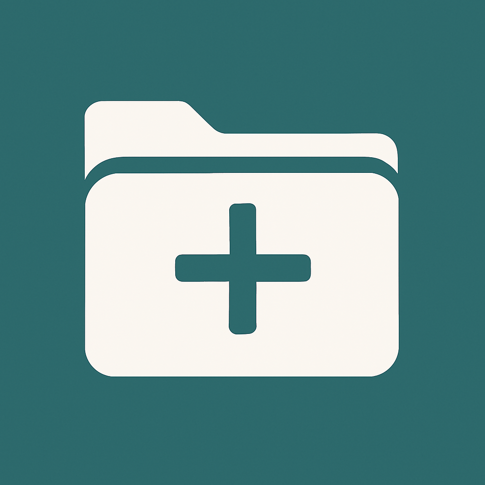

<p align="center">
  
</p>

<h1 align="center">DesktopPlus</h1>

<p align="center">
  A desktop-first Windows organizer with floating panels, tabs, auto-sort, and full theme control.
</p>

<p align="center">
  <a href="#quick-start">Quick Start</a> &middot;
  <a href="#why-this-project">Why</a> &middot;
  <a href="#features">Features</a> &middot;
  <a href="#code-signing-policy">Code signing policy</a> &middot;
  <a href="#hotkeys-and-shortcuts">Shortcuts</a> &middot;
  <a href="#troubleshooting">Troubleshooting</a>
</p>

<p align="center">
  
  
  
  
  
</p>

## Why This Project

DesktopPlus is built for people who want a fast desktop workflow without replacing Windows Explorer.

- Keep important folders and file groups always visible in lightweight desktop panels.
- Use tabs and multiple view modes to adapt each panel to its purpose.
- Sort new desktop clutter automatically by rule.
- Keep everything local on your machine.

## Features

| Area | What you get |
| --- | --- |
| Desktop panels | Create multiple floating panels for folders or pinned lists. |
| Tabs | Add, rename, reorder, detach, merge, and close tabs per panel. |
| Views | Tile view, details/list view, and photo album view. |
| Metadata | Show/hide metadata fields and reorder them via drag and drop. |
| Sorting | Click metadata headers in list view to toggle ascending/descending sort. |
| Search | In-panel search with async loading behavior for large folders. |
| Auto-sort | Rule-based desktop sorting with built-in and custom extension rules. |
| Target suggestions | Auto-sort target input suggests existing panel and tab names. |
| Layouts | Save and restore panel positions, visibility, and appearance presets. |
| Themes | Header/body/tabs theming with presets, typography, colors, shadows, and preview. |
| Global shortcuts | System-wide shortcuts for panel toggle and temporary foreground mode. |
| Tray integration | Run from system tray, reopen main window, and control app behavior. |
| Localization | German and English interface. |

## Code signing policy

Free code signing provided by SignPath.io, certificate by SignPath Foundation.

Policy details (roles, approval flow, privacy statement):
[CODE_SIGNING_POLICY.md](CODE_SIGNING_POLICY.md)

## Quick Start

### 1) Download and run

1. Open [Releases](https://github.com/Koala280/DesktopPlus/releases).
2. Download the latest `DesktopPlus-<version>-win-x64-portable.zip`.
3. Extract the zip.
4. Run `DesktopPlus.exe`.

### 2) First 5 minutes

1. Open the main window from the tray icon if needed.
2. Create a panel in the `Panels` tab.
3. Drag a folder or files onto the panel.
4. Open panel settings and choose view mode plus metadata fields.
5. Save your setup as a layout.
6. Optional: enable auto-sort in the `Auto-Sort` tab.

## Daily Workflow

1. Use one panel per context (for example: Work, Downloads, Screenshots).
2. Use tabs when one panel needs multiple sources.
3. Use list view when metadata and sorting matter.
4. Use photo album view for image-heavy folders.
5. Keep auto-sort enabled to keep the desktop clean continuously.

## Auto-Sort

DesktopPlus can move new desktop items into category targets automatically.

- Built-in categories include folders, images, videos, audio, documents, archives, installers/scripts, shortcuts, code files, and catch-all.
- You can add custom extension rules.
- Target fields support suggestions from existing panel and tab names.
- If a target already exists, DesktopPlus adds items there instead of creating duplicates.
- If no matching target exists, DesktopPlus creates one and places it at a free screen position.

### Auto-sort storage path

Sorted files are moved from your desktop into:

`%LOCALAPPDATA%\DesktopPlus\AutoSortStorage\`

## Hotkeys and Shortcuts

### Global hotkeys (default)

| Shortcut | Action |
| --- | --- |
| `Ctrl + Alt + H` | Toggle all panels (show/hide). |
| `Ctrl + Alt + F` | Bring panels to front temporarily while shortcut is active. |

### Panel shortcuts

| Shortcut | Action |
| --- | --- |
| `Delete` | Delete selection (recycle files or remove from list). |
| `Ctrl + C` | Copy selection. |
| `Ctrl + X` | Cut selection. |
| `Ctrl + V` | Paste selection. |
| `Ctrl + Mouse Wheel` | Zoom panel content. |
| `Ctrl/Alt + Click` | Additive multi-selection. |
| `Shift + Click` | Range selection. |
| `Shift + Right Click` | Classic Windows context menu. |
| `Ctrl + Drag` | Force copy on drag and drop. |
| `Shift + Drag` | Force move on drag and drop. |
| `Ctrl + Shift + Drag` | Create link on drag and drop. |

All global hotkeys are configurable in `Shortcuts`.

## Privacy and Local Data

DesktopPlus is local-first. It does not require an online account or cloud backend.

- Settings, layouts, presets, auto-sort rules, and panel state are saved in `%APPDATA%\DesktopPlus_Settings.json`.
- Auto-sort moved items are stored in `%LOCALAPPDATA%\DesktopPlus\AutoSortStorage\`.
- `Start with Windows` writes/removes `HKCU\Software\Microsoft\Windows\CurrentVersion\Run\DesktopPlus`.

## Unsigned Binary Note

Open-source releases can be unsigned. Windows SmartScreen may show a warning on first launch.

If this happens:

1. Click `More info`.
2. Click `Run anyway`.

## Build and Run From Source

### Requirements

- Windows 10/11
- .NET SDK 8.x

### Run

```powershell
dotnet restore
dotnet build -c Release
dotnet run -c Debug
```

## Release Build

Run preflight first:

```powershell
powershell -ExecutionPolicy Bypass -File .\scripts\release-preflight.ps1
```

Build artifacts:

```powershell
powershell -ExecutionPolicy Bypass -File .\scripts\build-release.ps1 -Version 1.0.0
```

Outputs:

- `artifacts\DesktopPlus-<version>-win-x64-portable.zip`
- `artifacts\installer\DesktopPlus-Setup-<version>.exe` (if Inno Setup is installed)
- `artifacts\SHA256SUMS.txt`
- `artifacts\release-manifest.json`

Full release documentation: [DEPLOYMENT.md](DEPLOYMENT.md)

## Troubleshooting

### Global shortcut does not work

- Another app may already use that hotkey.
- Change the shortcut in `Shortcuts` and click `Apply`.

### Main window opens minimized from tray

- Use `Open` in tray menu.
- If behavior persists, update to the latest release and reopen the app.

### Panels disappeared

- Use global toggle hotkey or `Panels -> Show all`.
- Verify hidden state in the `Panels` tab.

### Auto-sort did not move an item

- Confirm the rule is enabled.
- Confirm the extension matches exactly (for example `.psd`).
- Check write permissions for `%LOCALAPPDATA%\DesktopPlus\AutoSortStorage\`.

### UI state looks broken after major changes

- Close DesktopPlus.
- Backup then remove `%APPDATA%\DesktopPlus_Settings.json`.
- Start DesktopPlus again to regenerate defaults.

## Contributing

Read [CONTRIBUTING.md](CONTRIBUTING.md) before opening pull requests.

## Security

Report vulnerabilities via [SECURITY.md](SECURITY.md).

## License

Licensed under the MIT License. See [LICENSE](LICENSE).
